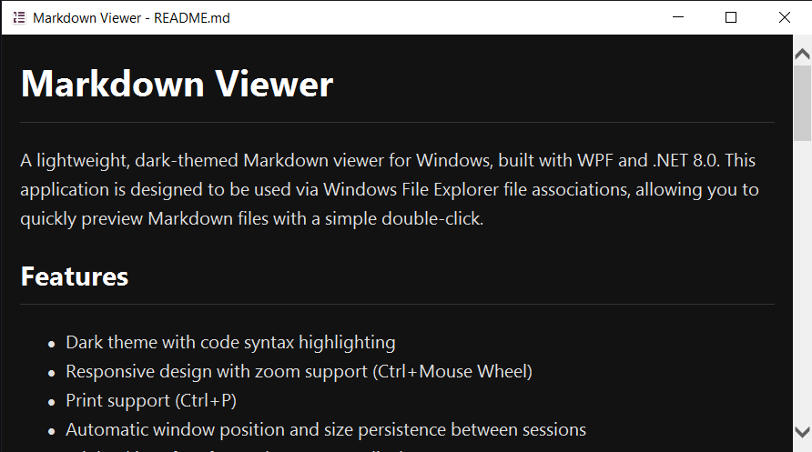

# Markdown Viewer

A lightweight, dark-themed Markdown viewer for Windows, built with WPF and .NET 8.0. This application is designed to be used via Windows File Explorer file associations, allowing you to quickly preview Markdown files with a simple double-click.



## Features

- Dark theme with code syntax highlighting
- Responsive design with zoom support (Ctrl+Mouse Wheel)
- Print support (Ctrl+P)
- Automatic window position and size persistence between sessions
- Minimal interface focused on content display
- Supports CommonMark and GitHub Flavored Markdown via Markdig

## Requirements

- Windows with .NET 8.0 Runtime
- Visual Studio 2022 or later (for development)

## Building the Application

1. Clone this repository
2. Open the solution in Visual Studio
3. Build the solution (Ctrl+Shift+B)
4. The executable will be located in the `bin/Debug/net8.0-windows` or `bin/Release/net8.0-windows` folder

## Setting Up File Associations

To associate Markdown files with this viewer:

1. Right-click on any `.md` file in Windows Explorer
2. Select "Open with" → "Choose another app"
3. Click "More apps" if necessary
4. Scroll down and click "Look for another app on this PC"
5. Navigate to the location of the built executable (`MarkdownViewer.exe`)
6. Check "Always use this app to open .md files"
7. Click "OK"

You can repeat this process for other Markdown file extensions like `.markdown`.

## Usage

Once file associations are set up:
- Double-click any Markdown file to open it in the viewer
- Use Ctrl+Mouse Wheel to zoom in/out
- Use Ctrl+P to print the rendered document
- Close the window when done

The viewer will remember your preferred window size and position for the next time you open a Markdown file.

## Command Line Usage

You can also launch the viewer from the command line:

```
MarkdownViewer.exe path\to\your\file.md
```

## License

[MIT License](LICENSE.md)
